# Network Panel

A containerized network management portal for a **reComputer R1035-10 / R1000-class edge device** running **Ubuntu Server** on NVMe SSD.

Network Panel is designed as a local web-based control and visibility layer for an edge gateway, field-service node, or home lab infrastructure device. It brings network role management, service visibility, wireless and cellular controls, monitoring tools, file sharing, device I/O visibility, and administrative actions into a single dashboard.

The project focuses on practical device operation: managing main and service LAN behavior, controlling internet access for selected interfaces, monitoring local services, inspecting live sessions, and preparing the device for remote support workflows.

---

## Project Goals

Network Panel is built to solve a specific real-world use case:

- operate a compact Linux edge device in the field or at home
- manage local network roles without constantly using the terminal
- control whether service-facing ports receive internet access
- keep infrastructure services visible from one dashboard
- support LTE/Wi-Fi based connectivity scenarios
- expose device-level hardware information such as LEDs, serial ports, GPIO and RS-485 readiness
- provide a clean UI for administration, monitoring and future expansion

It is not intended to be a full enterprise router replacement. It is a focused management portal for a self-hosted edge gateway.

---

## Main Features

- Dashboard with device overview, network map, routes, container status and live sessions
- Main LAN and Service LAN profile management
- Service LAN internet gating
- Interface status grouped by role
- Wi-Fi client and hotspot mode controls
- Cellular/LTE APN and modem tooling
- Guarded AT command interface
- Pi-hole and NetAlertX visibility
- Local service discovery and quick access
- Docker container overview
- File system and storage visibility
- Samba file sharing overview and share management
- Device I/O visibility for LEDs, serial ports, GPIO and RS-485
- Admin menu with sync, restart, power off and logout controls
- Session-cookie based login
- Dockerized backend and frontend deployment

---

## Hardware Target

The project is currently tailored around the **Seeed reComputer R1035-10 / R1000 family**.

Typical target setup:

- Raspberry Pi CM4-based reComputer device
- Ubuntu Server
- NVMe SSD as primary storage
- eMMC available as fallback or secondary storage
- Ethernet LAN ports
- Wi-Fi interface
- LTE modem support
- RS-485 capable device ports
- USER RGB LEDs and ACT/PWR LED exposure through Linux sysfs

---

## Hardware Notes

On the reComputer R1035-10, the Seeed overlay should be loaded as:

```txt
dtoverlay=reComputer-R100x
````

in:

```txt
/boot/firmware/config.txt
```

Do **not** add the `uart2` overlay parameter on this hardware revision unless you are intentionally testing the older alternate pin mapping. It can move the USER RGB LED mapping away from the PCA9535 expander used by this device.

The panel expects USER RGB LEDs at:

```txt
/sys/class/leds/led-red
/sys/class/leds/led-green
/sys/class/leds/led-blue
```

and ACT exposed as:

```txt
/sys/class/leds/ACT
```

Expected RS-485 ports are shown in the UI as:

```txt
/dev/ttyAMA2
/dev/ttyAMA3
/dev/ttyAMA5
```

---

## Architecture Overview

Network Panel is split into a backend and frontend.

```txt
network-panel/
├── assets/
│   └── images/
├── backend/
│   ├── app/
│   │   ├── main.py
│   │   └── portal.html
│   ├── data/
│   ├── scripts/
│   ├── Dockerfile
│   └── requirements.txt
├── frontend/
│   ├── src/
│   │   ├── app.js
│   │   └── styles.css
│   ├── dist/
│   ├── index.html
│   ├── package.json
│   └── vite.config.js
├── scripts/
├── docker-compose.yml
├── .dockerignore
├── .gitignore
└── README.md
```

---

## Backend

The backend is a Python/FastAPI service running inside Docker.

Main backend file:

```txt
backend/app/main.py
```

The backend is responsible for:

* serving API endpoints
* collecting device status
* reading interface and route information
* exposing Docker/container status
* managing session authentication
* handling panel users and session persistence
* running controlled network actions
* exposing Wi-Fi, LAN, cellular, file sharing, monitoring and device I/O data
* serving the compiled frontend in production mode

Backend data files are stored under:

```txt
backend/data/
```

Current data files include:

```txt
netalertx-sync-state.json
panel-auth.json
panel-sessions.json
runtime-config.json
```

These files are used for runtime state, authentication/session persistence and panel configuration.

Backend helper scripts live under:

```txt
backend/scripts/
```

Current backend scripts include:

```txt
service-lan-inet-off.sh
service-lan-inet-on.sh
service-lan-ra.py
```

These support Service LAN internet policy and router advertisement behavior.

---

## Frontend

The frontend is a Vite-based web interface.

Main frontend files:

```txt
frontend/src/app.js
frontend/src/styles.css
```

The frontend provides the browser UI for the panel. It talks to the backend through `/api`.

During development:

```sh
cd frontend
npm install
npm run dev
```

The Vite dev server proxies API requests to:

```txt
http://127.0.0.1:8080
```

Production images build the frontend and serve the compiled files from the backend container.

Compiled frontend output is generated under:

```txt
frontend/dist/
```

### Screenshot / Demo Mode

The frontend includes a screenshot-safe demo mode for documentation and release images.

Open the dev frontend with:

```txt
http://10.0.0.1:5173/?demo=1
```

Demo mode is frontend-only and does not change backend data or API behavior. It masks sensitive values such as hostnames, IP addresses, Tailscale addresses, IPv6 addresses, MAC addresses, SSIDs, usernames, session ports, log messages, and command payloads while keeping the UI layout realistic for screenshots.

---

## Stack

* Ubuntu Server
* Docker
* Docker Compose
* Python
* FastAPI
* Uvicorn
* Vite
* JavaScript
* CSS
* Pi-hole
* NetAlertX
* Tailscale
* Cockpit
* Grafana
* Prometheus
* Node Exporter
* Samba

---

## Integrated Services

Network Panel is designed to sit next to common self-hosted infrastructure services.

Currently integrated or visible services include:

* Tailscale
* Cockpit
* Grafana
* Prometheus
* Node Exporter
* Pi-hole
* NetAlertX
* Samba
* VirtualHere

The dashboard and service pages provide quick status visibility and access points for these tools.

---

## Running with Docker Compose

Create a local environment file first:

```sh
cp .env.example .env
```

Then edit `.env` and set a real panel password:

```txt
PANEL_PASSWORD=change-me-before-first-run
```

Start or rebuild the backend service:

```sh
docker compose up -d --build backend
```

Check running services:

```sh
docker compose ps
```

View backend logs:

```sh
docker compose logs --tail=80 backend
```

Follow backend logs:

```sh
docker compose logs -f backend
```

The backend container runs Uvicorn on:

```txt
0.0.0.0:8080
```

---

## Access and Authentication

The web panel uses a session-cookie login screen.

Set the panel password before starting the service:

```txt
PANEL_PASSWORD=change-me-before-first-run
```

`PANEL_USERNAME` defaults to `admin` unless overridden.

Signed-in users can change the panel username and password from the Users page. The updated credential hash is stored in:

```txt
/app/data/panel-auth.json
```

Active panel sessions are stored in:

```txt
/app/data/panel-sessions.json
```

This allows backend/container restarts without forcing a fresh login while the browser cookie is still valid.

Before exposing the panel beyond a trusted local network, change:

```txt
PANEL_USERNAME
PANEL_PASSWORD
```

in the deployment configuration.

---

## Networking Model

The panel separates network behavior into practical roles.

### Main LAN

Main LAN is the trusted local network or home lab segment. It is intended for normal local access, infrastructure tools, DNS, management and trusted client devices.

### Service LAN

Service LAN is an isolated service-facing client network. It is useful for field service work, temporary client devices, equipment configuration, or devices that should not automatically receive full access to the internal network.

The panel supports internet on/off behavior for this role so service-facing devices can be isolated or temporarily allowed online depending on the use case.

### Wireless

Wireless can be used as a client uplink or hotspot/local AP style interface depending on the device state and configuration.

### Cellular

Cellular/LTE support is designed for field deployment, fallback connectivity, or remote access scenarios.

---

## Interface Overview

The redesigned interface uses a dark operational dashboard style with grouped navigation, live status cards, action previews, and role-based network pages. It is built to make the R1000 easier to operate as both a field-service gateway and a home lab infrastructure node.

### Dashboard

The dashboard provides the main operational overview of the device. It summarizes uplinks, LAN state, wireless state, running containers, live sessions, local ports, detected clients, and key system health metrics.

The network map gives a quick visual relationship between internet, LAN, wireless, services, and the device itself.

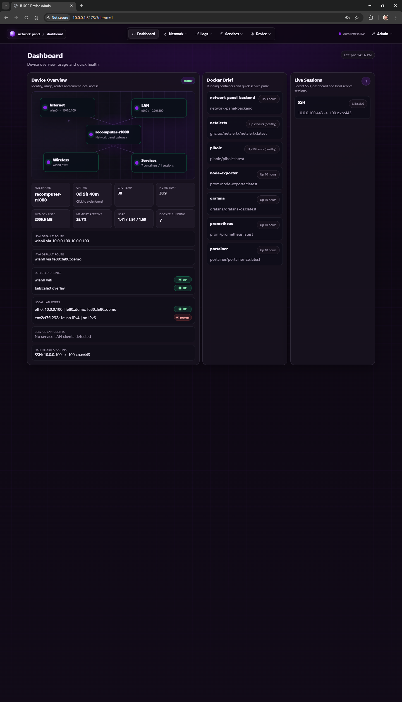

### Navigation

The top navigation groups related tools into clear sections such as Dashboard, Network, Logs, Services, and Device. Dropdown menus keep secondary pages available without crowding the main interface.

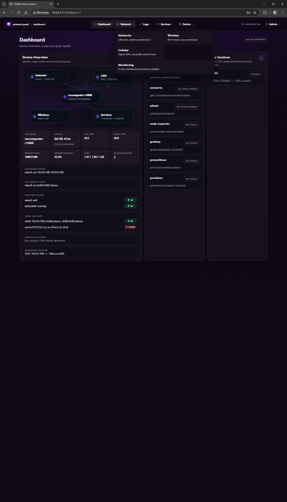

### Network

The Network page manages the Main LAN and Service LAN roles. It shows assigned interfaces, link states, internet policy, Pi-hole policy, addressing mode, DNS behavior, and connected clients.

Interface cards are grouped by uplinks, LAN ports, wireless, and virtual interfaces so physical and logical links are easier to scan.

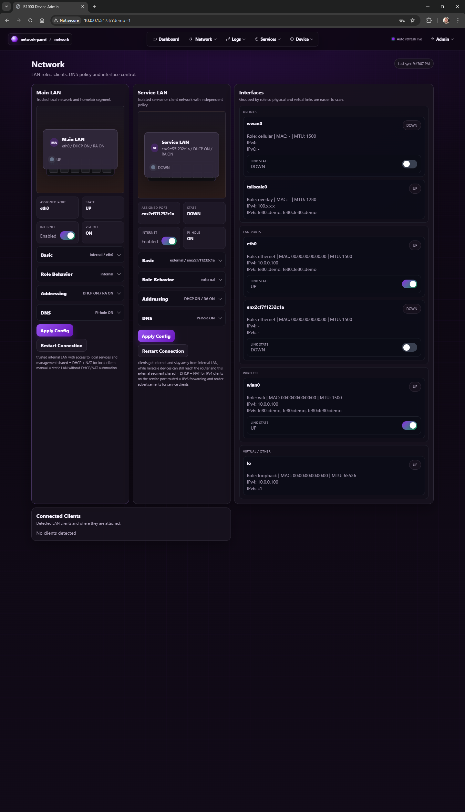

### Cellular

The Cellular page centralizes LTE and modem-related controls. It shows registration state, operator, signal metrics, APN profile information, uplink preference, and guarded AT command access.

APN presets and manual profile options are kept together so cellular behavior can be adjusted without mixing it into Wi-Fi or LAN pages.

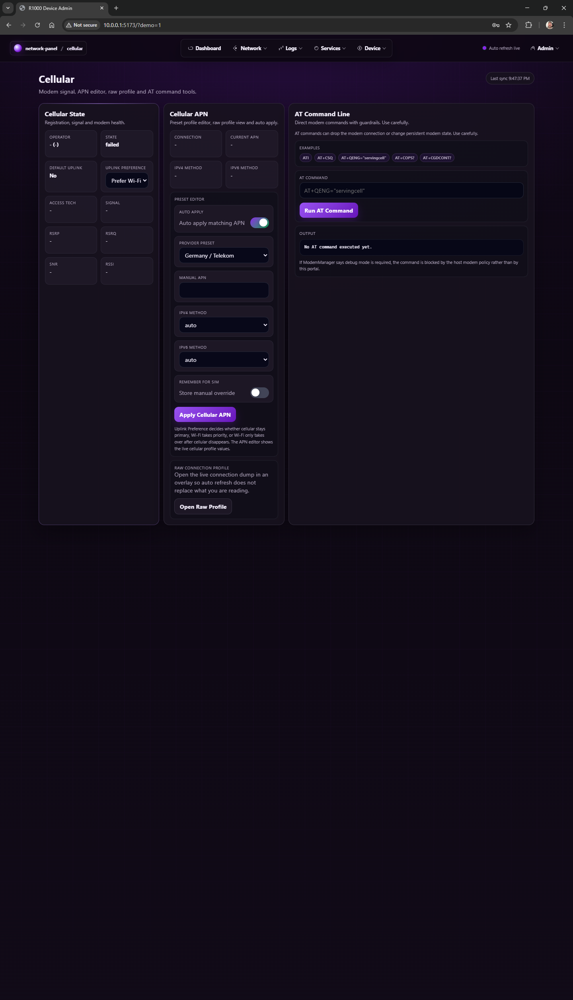

### Wireless

The Wireless page focuses on Wi-Fi client, hotspot, scan, and radio behavior.

Live state, configuration, connected clients, visible networks, and radio details are grouped into collapsible sections to keep the page readable while still exposing advanced information when needed.

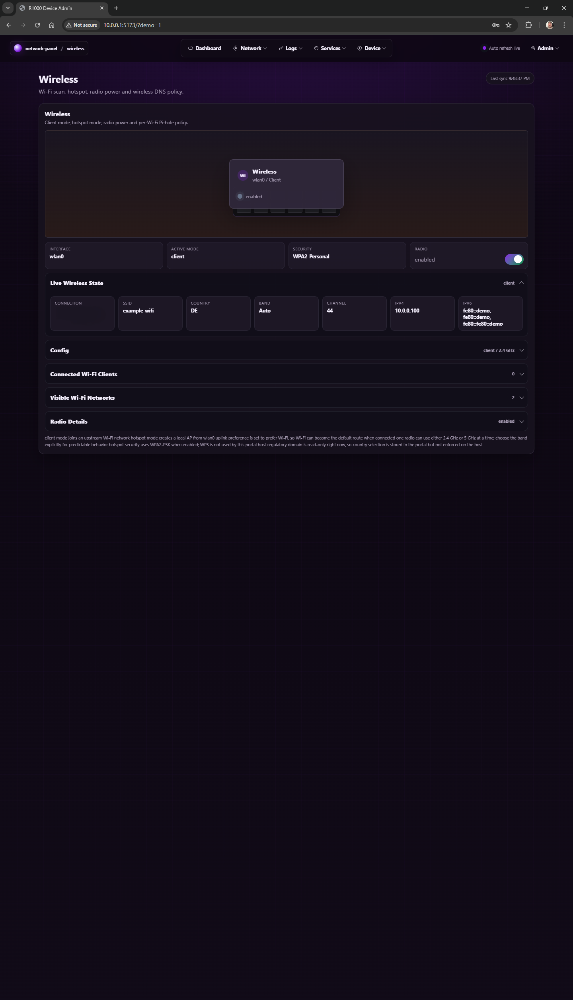

### Monitoring

The Monitoring page combines Pi-hole, NetAlertX, and network visibility controls.

It shows DNS forwarding status, Pi-hole binding information, NetAlertX discovery status, active scan targets, discovery scope, and high-level network state.

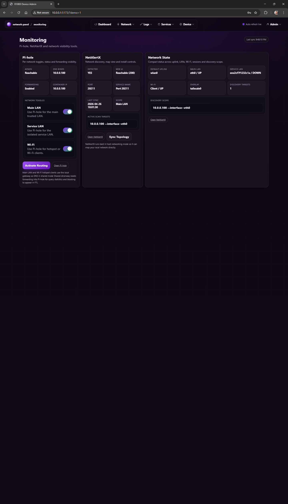

### Logs

The Logs page provides recent panel, network, and service activity in a compact table.

It is useful for checking dashboard sync events, detected listeners, DNS/SSH/session activity, Docker status, and service-level events without leaving the panel.

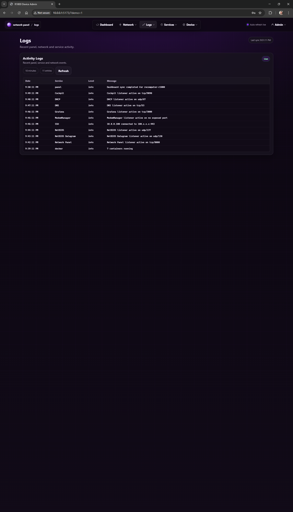

### Services

The Services page presents detected local listeners as compact service cards.

It highlights named services, protocol and source tags, online state, known entry points, and port-only listeners without forcing the operator into terminal inspection for every local service.

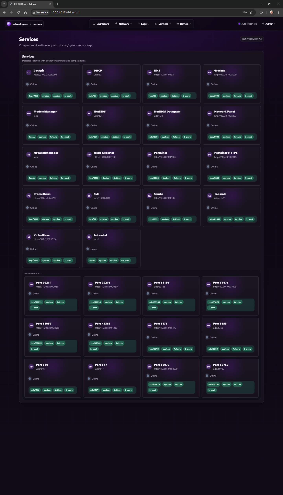

### File System

The File System page displays key mounts, storage devices, external or removable storage, and other mounted paths.

It helps verify NVMe, eMMC, boot partitions, overlay mounts, and available capacity from the web interface.

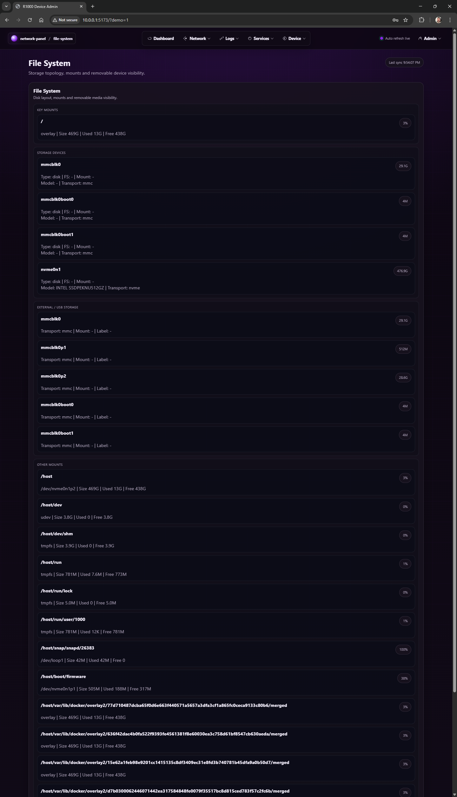

### File Sharing

The File Sharing page provides Samba share visibility and basic share management.

It shows running Samba services, configured shares, guest/read-only policy, valid users, and placeholder printing status for future CUPS support.

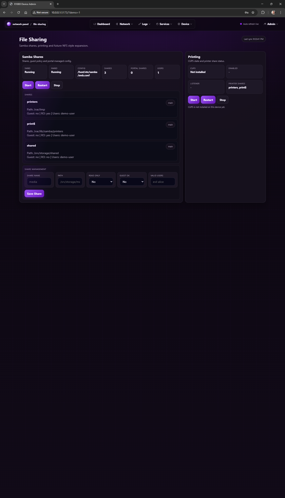

### Users

The Users page keeps panel account management and Samba user management in one place.

It supports panel credential updates, SMB account visibility, and Samba account actions while keeping authentication state separate from normal network controls.

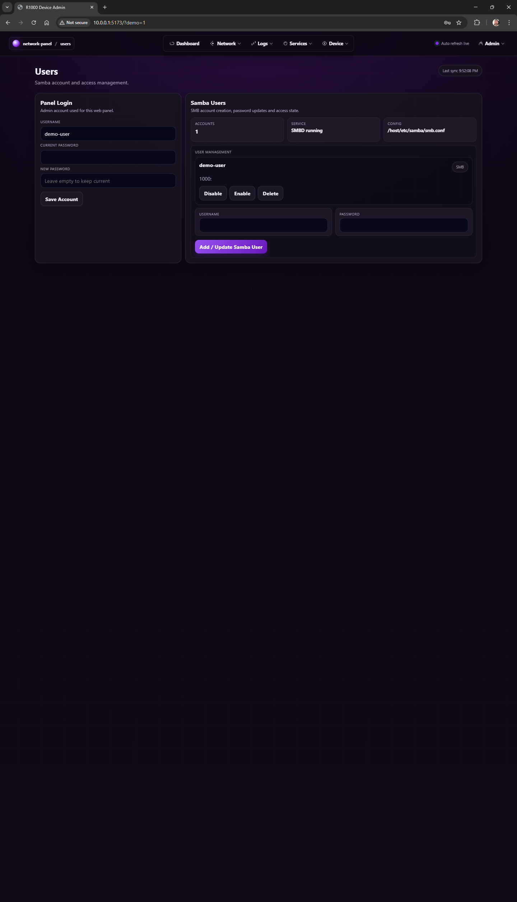

### Device I/O

The Device I/O page exposes kernel-visible LEDs, serial ports, GPIO chips, expected RS-485 ports, and LED policies.

It is designed for hardware validation on the reComputer R1000 platform, including ACT/PWR/user LED behavior and expansion readiness.

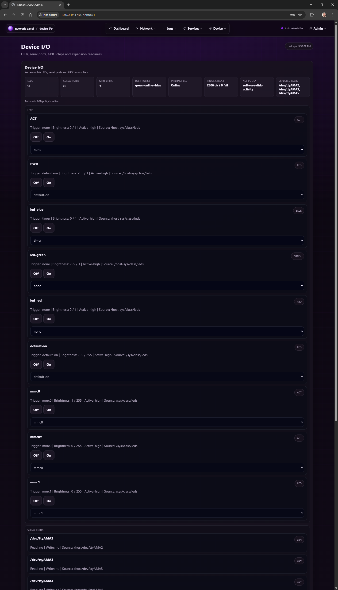

### LoRaWAN / Meshtastic

The LoRaWAN page is a reserved area for future radio-module workflows.

It is intended to hold LoRaWAN, Meshtastic, radio profiles, and related settings without scattering radio features across the dashboard.


### Admin Controls

The admin menu provides session information, manual sync, logout, restart, and power-off controls.

It keeps high-impact actions separated from normal network pages while still making them accessible for local administration.

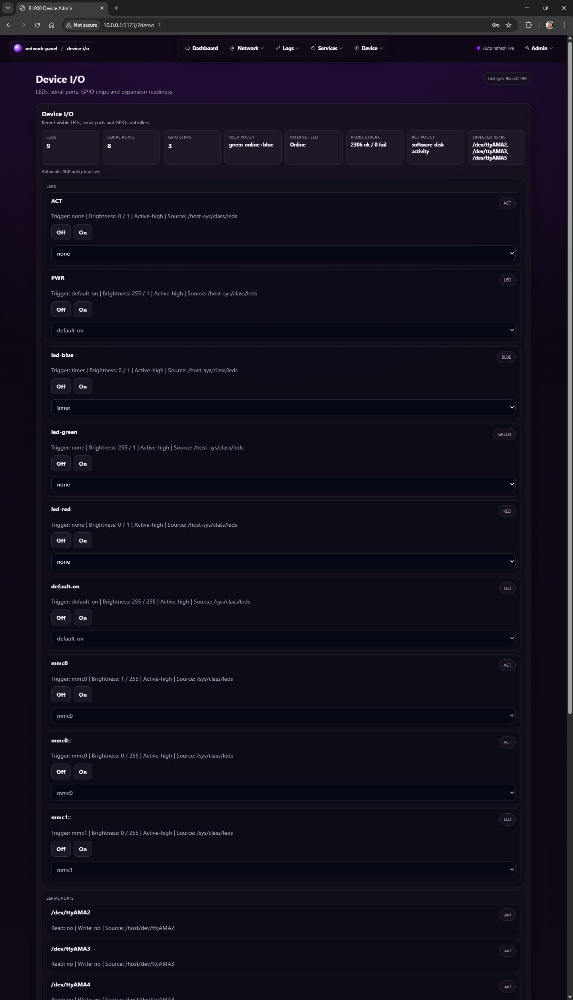

### Review and Run

Configuration changes can be reviewed before execution.

The review dialog shows the editable request payload and the exact host commands that will run, reducing the risk of applying network or wireless changes blindly.

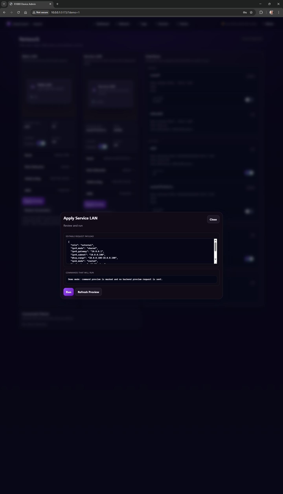

---

## Current Pages

The current UI includes or reserves pages for:

* Dashboard
* Network
* Wireless
* Cellular
* Monitoring
* Logs
* Services
* File System
* File Sharing
* Device I/O
* LoRaWAN / Meshtastic
* Admin controls
* Review and run dialogs

---

## Implemented

* LTE status visibility and APN-related controls
* Main LAN and Service LAN management
* Internet on/off controls for selected interfaces
* Wireless client and hotspot mode handling
* Local service discovery and quick access
* Monitoring-oriented service integration
* Initial dual-stack networking support
* Dashboard network map
* Live session visibility
* Docker service summary
* File system visibility
* Samba visibility and share management
* Device LED, serial port and GPIO visibility
* Admin sync/restart/power controls
* Review-before-run flow for network actions

---

## Current Work

* Real-world testing and validation
* Stability and usability improvements
* Additional network control features
* UI polish and responsive layout checks
* Better overflow handling for long interface names and addresses
* More complete service detail views
* Continued iteration based on practical usage

---

## Planned / Future Ideas

* Extended IPv6 routing support
* More detailed LTE and modem management
* Better APN profile handling
* Wi-Fi hotspot and client workflow hardening
* LoRaWAN / Meshtastic module integration
* OSDP / RS-485 lab support
* Better backup and restore tooling
* More detailed device health timeline
* Improved mobile layout
* Role-based admin controls
* Optional read-only dashboard mode

---

## Development Workflow

Recommended local frontend workflow:

```sh
cd frontend
npm install
npm run dev
```

Backend validation:

```sh
python3 -m py_compile backend/app/main.py
```

Frontend build validation:

```sh
cd frontend
npm run build
```

Docker rebuild:

```sh
cd ~/network-panel
docker compose up -d --build backend
```

Check backend logs:

```sh
docker compose logs --tail=80 backend
```

---

## Backup / WIP Safety

For large redesign work, create a WIP patch before continuing:

```sh
git diff > ~/network-panel-dashboard-redesign-wip.patch
```

For a full working-tree backup including untracked files:

```sh
tar -czf ~/network-panel-dashboard-redesign-wip-full.tar.gz \
  README.md backend/Dockerfile backend/app/main.py backend/app/portal.html docker-compose.yml \
  .dockerignore frontend scripts
```

A full patch including untracked files can be created by temporarily staging files:

```sh
git add README.md backend/Dockerfile backend/app/main.py backend/app/portal.html docker-compose.yml .dockerignore frontend scripts
git diff --cached > ~/network-panel-dashboard-redesign-wip-full.patch
git reset
```

This does not create a commit.

---

## Use Case

This platform is designed to serve both as:

* a field-service edge device
* a home lab infrastructure node

It provides selective internet access control for service-facing interfaces, which is especially useful when operating over limited LTE data plans or when working with devices that should only receive controlled connectivity.

---

## Status

Network Panel is actively evolving. The current version is a practical working prototype with a redesigned dashboard, network role management, monitoring pages, service visibility, wireless/cellular controls and hardware-focused device pages.

The project is suitable for homelab experimentation, edge gateway prototyping, and field-service workflow development.
